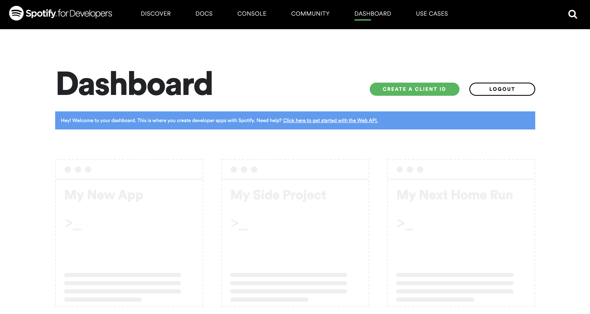
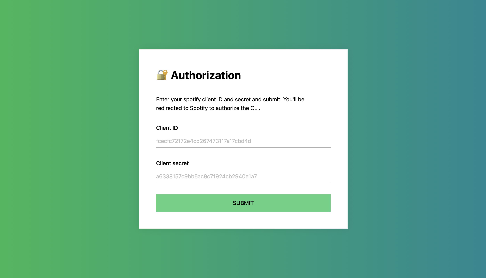
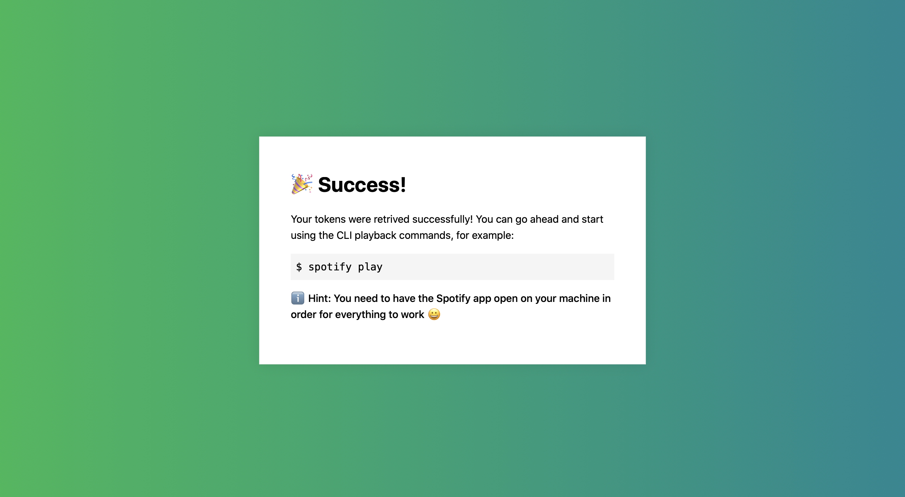

# 🎧 Spotify CLI

Control Spotify from your terminal.

## Authorization

The CLI makes use of Spotify's [authorization code flow](https://developer.spotify.com/documentation/general/guides/authorization-guide/#authorization-code-flow). This means you only have to grant permission once, and you get a refreshable access token with which to make requests.

Once you've gone through the authorization steps, your access token and refresh token are stored in a configuration file on your local machine. This is handled via the [conf library](https://github.com/sindresorhus/conf).

**Note:** In addition to your access token and refresh token, the configuration file also stores your client ID and client secret.

### Authorizing via Spotify

#### Registering an application

Before getting started, you'll need to register an application via the [Spotify developer dashboard](https://developer.spotify.com/dashboard).



You'll be prompted to fill out a few required fields. The name, description, etc for the application is up to you.

Once complete, you'll see your app dashboard where you can grab your client ID and client secret - make a note of these.

One last step here in the dashboard: In the top right, click **Edit settings**. You'll need to add a redirect URI to be used during the token retrieval process. By default, the CLI will spin up a server listening on port `8080` during the authentication steps, but you can specify another port if required.

Under **Redirect URIs**, add `http://localhost:<PORT>/callback` where `PORT` is either `8080` or the port number of your choosing, and click **Save**.

#### Retrieving an access token

In your terminal, run:

```bash
$ spotify auth
```

This will spin up a small express server on port `8080`. If you want to specify another port, run:

```bash
$ spotify auth [port]
```

Your default browser will now open at `http://localhost:<PORT>`.



Enter your client ID and secret and click **SUBMIT**.

You'll be redirected to Spotify, where you'll be asked to log in if needed and then prompted to authorize the application.

After you've authorized the application, you'll be redirected back to `http://localhost:<PORT>`. If everything went ok, you should see the success screen.



Now you can get started using the CLI! See below for usage and a full list of supported commands.

## Commands

- [auth](#auth)
- [play](#play)
- [pause](#pause)
- [skip](#skip)
- [volume](#volume)
- [mute](#mute)
- [share](#share)

## `auth`

`$ spotify auth [port]`

Launch server to start app authentication.

**Arguments**

- `port` - _Optional_. Specify the port to start the server on. Defaults to `8080`.

## `play`

`$ spotify play`

Start or resume playback.

## `pause`

`$ spotify pause`

Pause playback.

## `skip`

`$ spotify skip [direction]`

Skip track.

**Arguments**

- `direction` - _Optional_. The direction to skip - must be either `forward` or `back`. Defaults to `forward`.

## `volume`

`$ spotify volume <percent>`

Set playback volume.

**Arguments**

- `percent` - **Required**. The volume percent to set. Must be a number between 0 and 100.

## `mute`

`$ spotify mute`

Mute playback. Alias for `spotify volume 0`.

## `share`

`$ spotify share`

Get a shareable link for the currently playing track. Copies link to clipboard.

## `shuffle`

`$ spotify shuffle <state>`

Toggle playback shuffle.

**Arguments**

- `state` - **Required**. The shuffle state to set. Must be either `on` or `off`.

## `repeat`

`$ spotify repeat <mode>`

Set playback repeat mode..

**Arguments**

- `mode` - **Required**. The repeat mode to set. Must be either `track`, `context` or `off`.
